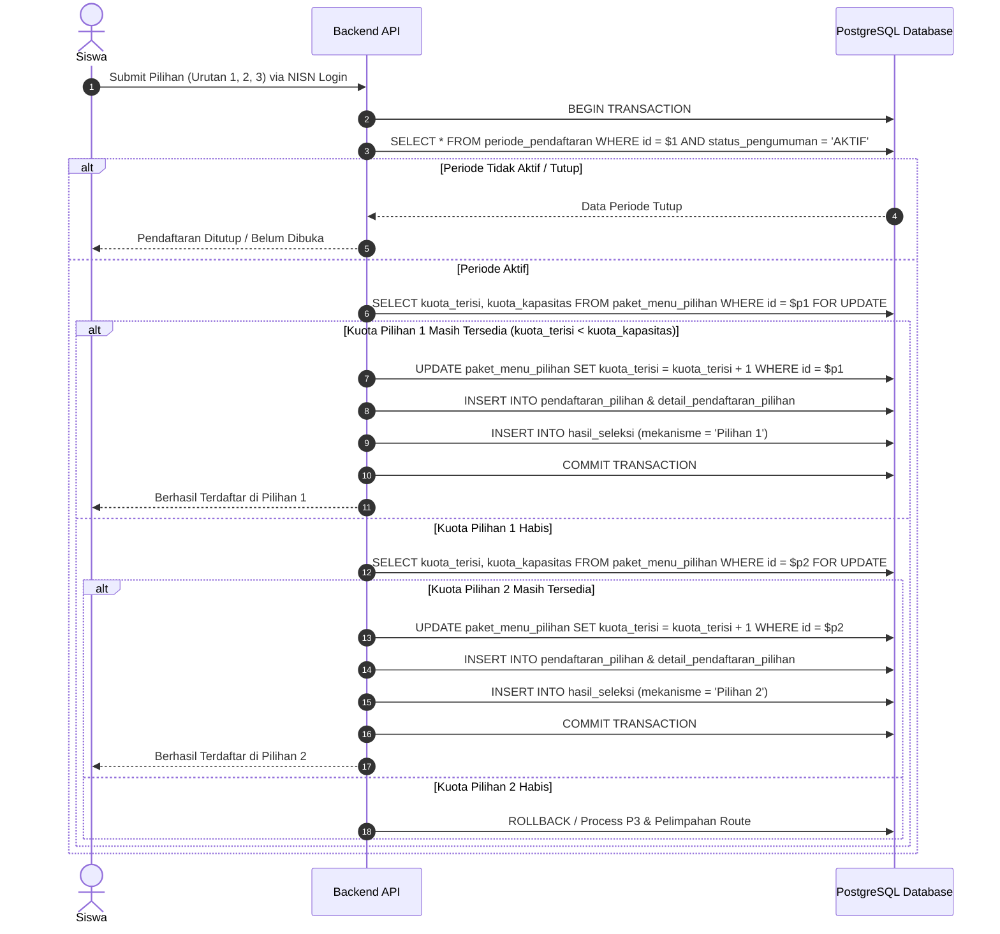
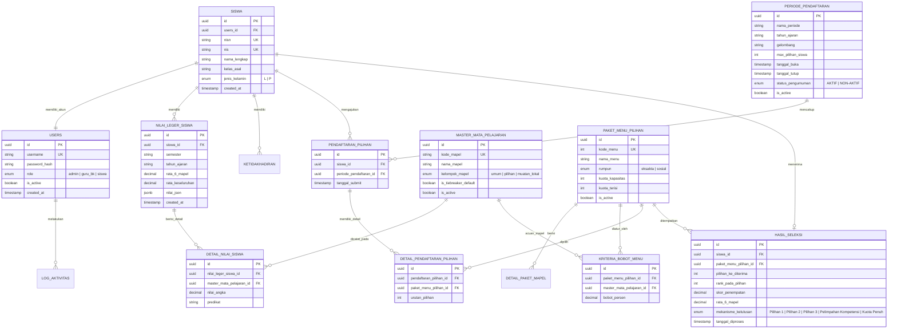

# Product Requirement Document (PRD) & Schema Database
## SISPAM-XI (School Class System) SMAN 1 WATES

---

## 1. Pendahuluan & Ringkasan Eksekutif

### 1.1 Latar Belakang
Proses pembagian kelas pilihan (Fase F) di SMAN 1 WATES sebelumnya dilakukan secara manual dengan mengekstrak data dari eRaport/Leger secara parsial. Hal tersebut berpotensi menimbulkan ketidakakuratan, memakan waktu lama, serta minim transparansi. **SISPAM-XI (School Class System)** dibangun untuk menyediakan otomasi *end-to-end* — mulai dari login siswa berbasis NISN, pendaftaran pilihan kelas/menu yang fleksibel, ekstraksi nilai eRaport/Leger, hingga komputasi penempatan otomatis berbasis aturan sekolah dan transparansi hasil bagi guru maupun siswa.

### 1.2 Tujuan Sistem
1. Membangun sistem pembagian kelas *end-to-end* yang berjalan otomatis tanpa proses manual tambahan (ekstraksi nilai, pembobotan, dan pengurutan).
2. Memfasilitasi siswa memilih **pilihan menu mata pelajaran secara fleksibel (dinamis)** sesuai batas maksimal pilihan yang dikonfigurasi oleh Guru/Admin (misal: 2, 3, 4, atau 5 pilihan).
3. Memberikan kontrol penuh bagi Guru/Admin dalam mengelola kriteria mapel, bobot nilai, kuota kelas, serta melihat hasil lengkap pendaftaran.
4. Menyediakan transparansi hasil penempatan siswa disertai alasan dan rincian perhitungan skor untuk seluruh tahapan gelombang pilihan.
5. **Arsitektur Murni PostgreSQL (Dapat Dideploy di Hosting Dasar)**: Menggunakan teknologi **PostgreSQL Murni** dengan *Row-Level Lock Transaction (`FOR UPDATE`)* untuk pencegahan *overbooking* kuota dan *SQL Window Functions (`ROW_NUMBER()`)* untuk komputasi ranking *real-time*, sehingga dapat dijalankan di hosting dasar/cPanel murah tanpa ketergantungan *third-party service*.

---

## 2. Landasan Hukum, Arsitektur Teknologi, & Aturan Bisnis

### 2.1 Arsitektur Teknologi Murni Database (Pure PostgreSQL)
* **Database Utama (RDBMS)**: **PostgreSQL** (Menangani penyimpanan persisten, transaksi atomik kuota, serta kalkulasi ranking real-time).
* **Backend API**: Node.js / PHP (Laravel/CodeIgniter) / Python (FastAPI) — mendukung *deployment* mudah di hosting dasar/shared hosting cPanel/VPS.
* **Frontend**: Mobile Web / Web App (Plus Jakarta Sans UI, Portal Pengumuman & Dashboard Admin).

### 2.2 Mekanisme Keamanan Transaksi & Ranking Murni PostgreSQL

| Tantangan Sistem | Solusi PostgreSQL Murni | Deskripsi & Query SQL |
| :--- | :--- | :--- |
| **1. Pencegahan Overbooking Kuota** | SQL Transaction Lock (`FOR UPDATE`) | Mengunci baris kuota menu yang dipilih selama proses *submit* pendaftaran untuk mencegah dua siswa mengambil sisa 1 kursi terakhir secara bersamaan. |
| **2. Merit Leaderboard Ranking** | SQL Window Function (`ROW_NUMBER()`) | Menghitung urutan peringkat persaingan siswa secara *real-time* berbasis skor pilihan dan tie-breaker rata-rata 6 mapel. |
| **3. Validasi Status Pengumuman** | Query Langsung `PERIODE_PENDAFTARAN` | Memeriksa `tanggal_buka`, `tanggal_tutup`, dan `status_pengumuman` langsung via query tanggal PostgreSQL. |
| **4. Proteksi Double Submit** | Unique Index Constraint | Menjamin 1 siswa hanya dapat terdaftar 1 kali per periode via `CONSTRAINT unique_siswa_per_periode`. |

---

### 2.3 Rencana Menu Pilihan & Alokasi Kuota

| Menu / Paket | Mapel Pilihan 1 | Mapel Pilihan 2 | Mapel Pilihan 3 | Mapel Pilihan 4 | Mapel Pilihan 5 | Rumpun | Kuota Siswa |
| :--- | :--- | :--- | :--- | :--- | :--- | :--- | :--- |
| **Menu 1 (P1)** | MTK TL | FISIKA | KIMIA | INFORMATIKA | PKWU | Eksakta (Sains) | 36 Kursi (1 Kelas) |
| **Menu 2 (P2)** | MTK TL | FISIKA | KIMIA | BIOLOGI | PKWU | Eksakta (Sains) | 72 Kursi (2 Kelas) |
| **Menu 3 (P3)** | MTK TL | FISIKA | BIOLOGI | EKONOMI | PKWU | Eksakta (Sains/Mixed) | 72 Kursi (2 Kelas) |
| **Menu 4 (P4)** | SEJARAH TL | EKONOMI | GEOGRAFI | B.INGGRIS TL | PKWU | Sosial / Soshum | 36 Kursi (1 Kelas) |
| **Menu 5 (P5)** | SEJARAH TL | EKONOMI | SOSIOLOGI | B.INGGRIS TL | PKWU | Sosial / Soshum | 36 Kursi (1 Kelas) |
| **TOTAL** | | | | | | | **252 Kursi (7 Kelas)** |

---

## 3. Algoritma Engine Seleksi Berlapis & Transaksi Atomik PostgreSQL

### 3.1 Flow Pemrosesan Transaksi Atomik Pendaftaran (`FOR UPDATE`)


---

## 4. Persyaratan Fungsional & Non-Fungsional (Requirements Matrix)

### 4.1 Functional Requirements (FR)

| Kode FR | Deskripsi Kebutuhan | Pengguna | Infrastruktur Utama |
| :--- | :--- | :--- | :--- |
| **FR-001** | Sistem memperbolehkan siswa untuk login menggunakan **NISN** | Siswa | Database PostgreSQL |
| **FR-002** | Sistem memperbolehkan siswa memilih **pilihan kelas secara dinamis** (maksimal pilihan diatur guru) | Siswa | Dynamic Choice Engine & DB |
| **FR-003** | Sistem memperbolehkan siswa untuk melihat hasil pembagian kelas & alasan perhitungan | Siswa | PostgreSQL Query Lookup |
| **FR-004** | Sistem memperbolehkan siswa melihat pengumuman jadwal proses pembagian kelas | Siswa | Tabel `PERIODE_PENDAFTARAN` |
| **FR-005** | Sistem memperbolehkan guru untuk mengekstrak & mengelola nilai dari eRaport/Leger secara **dinamis** | Guru/Admin | PostgreSQL Dynamic JSONB Store |
| **FR-006** | Sistem memperbolehkan guru untuk mengatur kuota masing-masing kelas | Guru/Admin | Tabel `PAKET_MENU_PILIHAN` |
| **FR-007** | Sistem memperbolehkan guru mengatur mata pelajaran, bobot nilai, dan **jumlah maksimal pilihan siswa** | Guru/Admin | Dynamic Formula Engine |
| **FR-008** | Sistem memperbolehkan guru melihat hasil lengkap seluruh siswa (termasuk yang tidak lolos) | Guru/Admin | SQL Window Ranking & DB Export |

### 4.2 Non-Functional Requirements (NFR)
* **Easy Deployment**: Bebas ketergantungan *third-party service* external — dapat di-*deploy* langsung di shared hosting cPanel/VPS termurah sekalipun.
* **Security**: Proteksi *atomic row lock* pada transaksi pendaftaran dan isolasi data antar siswa via NISN.
* **Usability**: Tampilan ringkas, intuitif, dan hasil perhitungan dapat dipahami tanpa perlu penjelasan tambahan.

---

## 5. Perancangan Schema Database Terperinci (Standardized Foreign Key Naming)

### 5.1 Diagram Hubungan Entitas (Mermaid ERD)



---

### 5.2 SQL DDL (Standardized PostgreSQL Schema Script)

```sql
-- Dynamic Extension Setup
CREATE EXTENSION IF NOT EXISTS "uuid-ossp";

-- ============================================================================
-- 1. DEKLARASI TIPE DATA ENUM BESERTA NILAI OPSI LENGKAP
-- ============================================================================

CREATE TYPE user_role AS ENUM ('admin', 'guru_bk', 'siswa');
CREATE TYPE jenis_kelamin_type AS ENUM ('L', 'P');
CREATE TYPE rumpun_type AS ENUM ('eksakta', 'sosial');
CREATE TYPE kelulusan_type AS ENUM ('Pilihan 1', 'Pilihan 2', 'Pilihan 3', 'Pelimpahan Kompetensi', 'Kuota Penuh');
CREATE TYPE kel_mapel_type AS ENUM ('umum', 'pilihan', 'muatan_lokal');
CREATE TYPE status_pengumuman_type AS ENUM ('AKTIF', 'NON-AKTIF');

-- ============================================================================
-- 2. STRUKTUR TABEL DATABASE (Penamaan Foreign Key Tepat Sama Dengan Nama Tabel)
-- ============================================================================

-- TABEL USERS (Autentikasi Sistem)
CREATE TABLE users (
    id UUID PRIMARY KEY DEFAULT uuid_generate_v4(),
    username VARCHAR(50) UNIQUE NOT NULL,
    password_hash VARCHAR(255) NOT NULL,
    role user_role NOT NULL DEFAULT 'siswa',
    is_active BOOLEAN DEFAULT TRUE,
    created_at TIMESTAMP WITH TIME ZONE DEFAULT CURRENT_TIMESTAMP,
    updated_at TIMESTAMP WITH TIME ZONE DEFAULT CURRENT_TIMESTAMP
);

-- TABEL SISWA (Master Identitas Siswa)
CREATE TABLE siswa (
    id UUID PRIMARY KEY DEFAULT uuid_generate_v4(),
    users_id UUID REFERENCES users(id) ON DELETE SET NULL,
    nisn VARCHAR(10) UNIQUE NOT NULL,
    nis VARCHAR(10) UNIQUE NOT NULL,
    nama_lengkap VARCHAR(150) NOT NULL,
    kelas_asal VARCHAR(10) NOT NULL,
    jenis_kelamin jenis_kelamin_type NOT NULL DEFAULT 'L',
    created_at TIMESTAMP WITH TIME ZONE DEFAULT CURRENT_TIMESTAMP
);

-- TABEL PERIODE_PENDAFTARAN
CREATE TABLE periode_pendaftaran (
    id UUID PRIMARY KEY DEFAULT uuid_generate_v4(),
    nama_periode VARCHAR(100) NOT NULL,
    tahun_ajaran VARCHAR(10) NOT NULL,
    gelombang VARCHAR(20) DEFAULT 'Utama',
    max_pilihan_siswa INT NOT NULL DEFAULT 3,
    tanggal_buka TIMESTAMP WITH TIME ZONE NOT NULL,
    tanggal_tutup TIMESTAMP WITH TIME ZONE NOT NULL,
    status_pengumuman status_pengumuman_type NOT NULL DEFAULT 'NON-AKTIF',
    is_active BOOLEAN DEFAULT TRUE,
    created_at TIMESTAMP WITH TIME ZONE DEFAULT CURRENT_TIMESTAMP
);

-- Seed Periode Pendaftaran Default
INSERT INTO periode_pendaftaran (nama_periode, tahun_ajaran, gelombang, max_pilihan_siswa, tanggal_buka, tanggal_tutup, status_pengumuman, is_active) VALUES
('Pemilihan Mapel Fase F 2026/2027', '2026/2027', 'Utama', 3, '2026-07-01 08:00:00+07', '2026-07-15 23:59:59+07', 'AKTIF', TRUE);

-- TABEL MASTER_MATA_PELAJARAN
CREATE TABLE master_mata_pelajaran (
    id UUID PRIMARY KEY DEFAULT uuid_generate_v4(),
    kode_mapel VARCHAR(20) UNIQUE NOT NULL,
    nama_mapel VARCHAR(100) NOT NULL,
    kelompok_mapel kel_mapel_type DEFAULT 'umum',
    is_tiebreaker_default BOOLEAN DEFAULT FALSE,
    is_active BOOLEAN DEFAULT TRUE,
    created_at TIMESTAMP WITH TIME ZONE DEFAULT CURRENT_TIMESTAMP
);

-- Seed Master Mapel SMAN 1 WATES
INSERT INTO master_mata_pelajaran (kode_mapel, nama_mapel, kelompok_mapel, is_tiebreaker_default) VALUES
('MAT_U', 'Matematika Utama', 'umum', TRUE),
('IPA', 'Ilmu Pengetahuan Alam', 'umum', TRUE),
('INFOR', 'Informatika', 'umum', TRUE),
('IPS', 'Ilmu Pengetahuan Sosial', 'umum', TRUE),
('BING', 'Bahasa Inggris', 'umum', TRUE),
('EKO', 'Ekonomi', 'umum', TRUE),
('PAIBP', 'Pendidikan Agama dan Budi Pekerti', 'umum', FALSE),
('PKN', 'Pendidikan Pancasila dan Kewarganegaraan', 'umum', FALSE),
('BIND', 'Bahasa Indonesia', 'umum', FALSE),
('PJOK', 'PJOK', 'umum', FALSE),
('SENBUD', 'Seni dan Budaya', 'umum', FALSE),
('MULOK', 'Bahasa Jawa / Mulok', 'muatan_lokal', FALSE);

-- TABEL NILAI_LEGER_SISWA
CREATE TABLE nilai_leger_siswa (
    id UUID PRIMARY KEY DEFAULT uuid_generate_v4(),
    siswa_id UUID REFERENCES siswa(id) ON DELETE CASCADE,
    tahun_ajaran VARCHAR(10) NOT NULL DEFAULT '2024/2025',
    semester VARCHAR(10) NOT NULL DEFAULT 'Genap',
    rata_6_mapel NUMERIC(5,2) DEFAULT 0.00,
    rata_keseluruhan NUMERIC(5,2) DEFAULT 0.00,
    nilai_json JSONB DEFAULT '{}'::jsonb,
    created_at TIMESTAMP WITH TIME ZONE DEFAULT CURRENT_TIMESTAMP,
    CONSTRAINT unique_siswa_periode UNIQUE (siswa_id, tahun_ajaran, semester)
);

-- TABEL DETAIL_NILAI_SISWA
CREATE TABLE detail_nilai_siswa (
    id UUID PRIMARY KEY DEFAULT uuid_generate_v4(),
    nilai_leger_siswa_id UUID REFERENCES nilai_leger_siswa(id) ON DELETE CASCADE,
    master_mata_pelajaran_id UUID REFERENCES master_mata_pelajaran(id) ON DELETE CASCADE,
    nilai_angka NUMERIC(5,2) NOT NULL DEFAULT 0.00,
    predikat VARCHAR(5),
    CONSTRAINT unique_leger_mapel UNIQUE (nilai_leger_siswa_id, master_mata_pelajaran_id)
);

-- Indexing JSONB & Foreign Keys untuk performa tinggi
CREATE INDEX idx_nilai_json ON nilai_leger_siswa USING gin (nilai_json);
CREATE INDEX idx_detail_nilai_leger ON detail_nilai_siswa(nilai_leger_siswa_id);

-- TABEL KETIDAKHADIRAN
CREATE TABLE ketidakhadiran (
    id UUID PRIMARY KEY DEFAULT uuid_generate_v4(),
    siswa_id UUID REFERENCES siswa(id) ON DELETE CASCADE,
    sakit INT DEFAULT 0,
    izin INT DEFAULT 0,
    alpa INT DEFAULT 0
);

-- TABEL PAKET_MENU_PILIHAN
CREATE TABLE paket_menu_pilihan (
    id UUID PRIMARY KEY DEFAULT uuid_generate_v4(),
    kode_menu INT UNIQUE NOT NULL,
    nama_menu VARCHAR(50) NOT NULL,
    rumpun rumpun_type NOT NULL,
    kuota_kapasitas INT NOT NULL DEFAULT 36,
    kuota_terisi INT NOT NULL DEFAULT 0,
    is_active BOOLEAN DEFAULT TRUE
);

-- Seed Default Kuota SMAN 1 WATES
INSERT INTO paket_menu_pilihan (kode_menu, nama_menu, rumpun, kuota_kapasitas) VALUES
(1, 'Menu 1 (P1)', 'eksakta', 36),
(2, 'Menu 2 (P2)', 'eksakta', 72),
(3, 'Menu 3 (P3)', 'eksakta', 72),
(4, 'Menu 4 (P4)', 'sosial', 36),
(5, 'Menu 5 (P5)', 'sosial', 36);

-- TABEL KRITERIA_BOBOT_MENU
CREATE TABLE kriteria_bobot_menu (
    id UUID PRIMARY KEY DEFAULT uuid_generate_v4(),
    paket_menu_pilihan_id UUID REFERENCES paket_menu_pilihan(id) ON DELETE CASCADE,
    master_mata_pelajaran_id UUID REFERENCES master_mata_pelajaran(id) ON DELETE CASCADE,
    bobot_persen NUMERIC(5,2) NOT NULL DEFAULT 100.00
);

-- TABEL PENDAFTARAN_PILIHAN
CREATE TABLE pendaftaran_pilihan (
    id UUID PRIMARY KEY DEFAULT uuid_generate_v4(),
    siswa_id UUID REFERENCES siswa(id) ON DELETE CASCADE,
    periode_pendaftaran_id UUID REFERENCES periode_pendaftaran(id) ON DELETE CASCADE,
    tanggal_submit TIMESTAMP WITH TIME ZONE DEFAULT CURRENT_TIMESTAMP,
    CONSTRAINT unique_siswa_per_periode UNIQUE (siswa_id, periode_pendaftaran_id)
);

-- TABEL DETAIL_PENDAFTARAN_PILIHAN
CREATE TABLE detail_pendaftaran_pilihan (
    id UUID PRIMARY KEY DEFAULT uuid_generate_v4(),
    pendaftaran_pilihan_id UUID REFERENCES pendaftaran_pilihan(id) ON DELETE CASCADE,
    paket_menu_pilihan_id UUID REFERENCES paket_menu_pilihan(id) ON DELETE CASCADE,
    urutan_pilihan INT NOT NULL,
    CONSTRAINT unique_pendaftaran_urutan UNIQUE (pendaftaran_pilihan_id, urutan_pilihan),
    CONSTRAINT unique_pendaftaran_paket UNIQUE (pendaftaran_pilihan_id, paket_menu_pilihan_id)
);

-- TABEL HASIL_SELEKSI
CREATE TABLE hasil_seleksi (
    id UUID PRIMARY KEY DEFAULT uuid_generate_v4(),
    siswa_id UUID UNIQUE REFERENCES siswa(id) ON DELETE CASCADE,
    paket_menu_pilihan_id UUID REFERENCES paket_menu_pilihan(id),
    pilihan_ke_diterima INT,
    rank_pada_pilihan INT,
    skor_penempatan NUMERIC(5,2) NOT NULL,
    rata_6_mapel NUMERIC(5,2) NOT NULL,
    mekanisme kelulusan_type NOT NULL,
    tanggal_diproses TIMESTAMP WITH TIME ZONE DEFAULT CURRENT_TIMESTAMP
);
```

---

## 6. Success Metrics (Indikator Keberhasilan System)
1. **Dapat Dideploy di Hosting Dasar**: Arsitektur murni PostgreSQL tanpa ketergantungan Redis / *third-party service*, siap di-*deploy* langsung di shared hosting cPanel maupun VPS termurah.
2. **Keamanan Transaksi Anti-Overbooking**: *Row-Level Lock (`FOR UPDATE`)* PostgreSQL menjamin tidak ada *race condition* atau kuota bocor saat *high concurrency*.
3. **Penyusunan Kuota Presisi**: 252 kursi terisi secara seimbang (Rumpun Sains max 180, Rumpun Sosial max 72).
4. **Standarisasi Penamaan Foreign Key 100%**: Seluruh kolom Foreign Key dinamai persis sesuai dengan `{nama_tabel}_id`.
5. **Fleksibilitas Jumlah Pilihan 100%**: Guru bebas menentukan batas maksimal pilihan siswa via `max_pilihan_siswa`.
